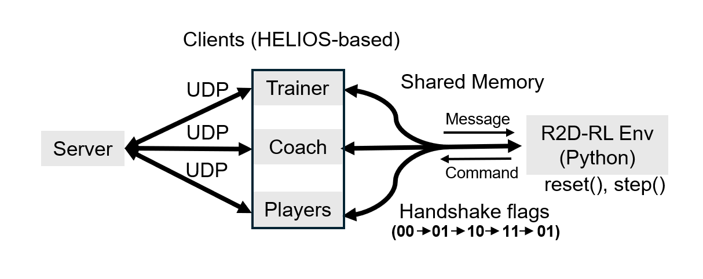

# R2DRL - RCSS 2D Reinforcement Learning

## Overview

R2DRL is a reinforcement learning framework for RoboCup 2D Soccer Simulation. This guide will walk you through the complete setup process, from installing dependencies to running your first training session.


## Quick Start Guide

### 1. Clone the R2DRL Repository

First, clone the R2DRL source code and navigate to the project directory:

```bash
git clone https://github.com/open-starlab/R2DRL.git
cd R2DRL
```

**Note:** All subsequent operations should be performed from this root directory unless otherwise specified.

### 2. Setup RoboCup Soccer Server (rcssserver)

The soccer server is the core simulator for RoboCup 2D Soccer Simulation.

#### 2.1 Clone the Repository

```bash
git clone https://github.com/rcsoccersim/rcssserver.git
```

#### 2.2 Modify Timeout Settings

To accommodate reinforcement learning training, which may require longer decision times, modify the server's timeout setting to an extremely large value:

```bash
sed -i.bak '2396s/.*/    const double max_msec_waited = 60 * 60 * 1000;/' rcssserver/src/stadium.cpp
```

This change prevents the server from timing out during training episodes.

#### 2.3 Build and Install

Follow the instructions in the rcssserver README to compile and install.

### 3. Setup RoboCup Soccer Monitor (rcssmonitor)

The monitor provides visualization for soccer matches.

#### 3.1 Clone the Repository

```bash
git clone https://github.com/rcsoccersim/rcssmonitor.git
```

#### 3.2 Build and Install

Follow the instructions in the rcssmonitor README to compile and install.

### 4. Setup librcsc (RoboCup Soccer Common Library)

librcsc is a fundamental library providing basic functionalities for RCSS 2D agents.

#### 4.1 Clone the Repository

```bash
git clone https://github.com/helios-base/librcsc.git
```

#### 4.2 Apply R2DRL Modifications

The R2DRL project includes modified versions of librcsc files. Copy these modifications to the cloned repository:

```bash
cp -r R2DRL/librcsc/* librcsc/
```

**What's Modified:** The R2DRL modifications include adjustments for reinforcement learning integration, custom action interfaces, and state observation enhancements.

#### 4.3 Build and Install

Follow the instructions in the librcsc README to compile and install.

### 5. Setup Helios Base

Helios Base is a sample team that serves as the foundation for R2DRL agents.

#### 5.1 Clone the Repository

```bash
git clone https://github.com/helios-base/helios-base.git
```

#### 5.2 Apply R2DRL Modifications

Copy the R2DRL-modified helios-base files:

```bash
cp -r R2DRL/helios-base/* helios-base/
```

**What's Modified:** The modifications include integration points for reinforcement learning policies, custom communication protocols with the Python training environment, and modified decision-making logic.

#### 5.3 Build and Install

Follow the instructions in the helios-base README to compile.

### 6. Configure Python Environment

The Python environment provides the reinforcement learning interface.

#### 6.1 Configure Paths

Before running, you must update the configuration file with your actual system paths:

1. Copy and rename `R2DRL/robocup2d/robocup.yaml` to your desired location.
2. Update the following fields with the correct paths to your installations. For example:

```yaml
player_dir: "<PROJECT_ROOT>/helios-base/src/player"
player_exe: "./sample_player"
coach_dir:  "<PROJECT_ROOT>/helios-base/src/coach"
coach_exe:  "./sample_coach"
server_path: "<PROJECT_ROOT>/rcssserver/build/rcssserver"
trainer_dir: "<PROJECT_ROOT>/helios-base/src/trainer"
trainer_exe: "./sample_trainer"
config_dir: "<PROJECT_ROOT>/helios-base/src/formations-dt"
player_config: "<PROJECT_ROOT>/helios-base/src/player.conf"

lib_paths:
    - <PROJECT_ROOT>/librcsc/rcsc/.libs
```

#### 6.2 Install the R2DRL Python Package

Navigate to the R2DRL Python package directory and install it in editable mode:

```bash
cd R2DRL/R2DRL/robocup2d
pip install -e .
```

#### 6.3 Use Standard Kickoff Formation

In `R2DRL/robocup2d/protocols/trainer_shm.py`, replace the existing `write_fixed_reset` block:

```python
def write_fixed_reset(buf):
    write_reset_payload(
        buf,
        ball=BALL_201,
        left_players=LEFT_FIXED_201,
        right_players=RIGHT_FIXED_201,
        opcode=OP_RESET_FROM_PY,
    )
```
with the following kickoff layout:

```python

BALL = (0.0, 0.0, 0.0, 0.0)  # (x, y, vx, vy)

LEFT_FIXED = [  # (x, y, body_deg)  # vx,vy = 0
    (-49.4387,   0.0290,   94.2210),   # 1
    (-15.8660,  -4.7522,   16.9550),   # 2
    (-15.2561,   4.4188,  -16.2620),   # 3
    (-10.2079, -14.4404,   55.6470),   # 4
    (-11.5515,  13.1860,  -48.5820),   # 5
    ( -6.6729,  -0.2970,   -2.0820),   # 6
    ( -1.2355,  -6.6095,   77.0410),   # 7
    ( -0.9691,   6.7240,  -81.6370),   # 8
    ( -1.7809, -19.9735,   85.0590),   # 9
    ( -1.1504,  22.6600,   42.1780),   # 10
    ( -0.3979,  -0.0031, -178.0480),   # 11
]

RIGHT_FIXED = [  # (x, y, body_deg)  # vx,vy = 0
    ( 49.3900,   0.0862,  -90.1690),   # 1
    ( 13.4133,   4.7750, -170.3380),   # 2
    ( 13.1628,  -4.1750,   71.8900),   # 3
    ( 13.1666,  15.2338,  160.2810),   # 4
    ( 12.8703, -13.3634, -163.4690),   # 5
    ( 13.9040,   0.9535,  176.0900),   # 6
    (  7.4706,   7.3084,  -46.1100),   # 7
    (  8.4330,  -7.8449,   46.7290),   # 8
    (  1.7011,  11.1080,  175.1860),   # 9
    (  2.4630, -11.3121,    8.9270),   # 10
    (  9.7244,   4.6590,  -63.9550),   # 11
]


def write_fixed_reset(buf):
    write_reset_payload(
        buf,
        ball=KICKOFF_BALL,
        left_players=LEFT_KICKOFF_STANDARD,
        right_players=RIGHT_KICKOFF_STANDARD,
        opcode=OP_RESET_FROM_PY,
    )
```

Feel free to customize the initial formation layout to suit your preference.

#### 6.4 Optional: Adjusting Team Size

The environment defaults to a standard 11v11 match, but supports flexible team sizes (e.g., 3v3).
You can configure the number of players for each team by modifying the `n1` and `n2` parameters in `robocup.yaml`. For example, for a 3v3 match:

```yaml
env_args:
  n1: 3
  n2: 3
```

### 7. Running Your First Training Session
You can now create a training script or use the provided examples to start training your RL agents. Here's a simple example to get you started:

```python
import numpy as np
from robocup2d import Robocup2dEnv

env = Robocup2dEnv("/path/to/your/robocup.yaml")
env.reset()

n_agents = env.n1
done = False
step_count = 0

while not done:
    obs = env.get_obs()
    state = env.get_state()
    avail_actions = env.get_avail_actions()
    
    actions = np.random.randint(0, 17, size=n_agents)
    reward, done, info = env.step(actions)
    step_count += 1

env.close()
```

### 8. Troubleshooting

Sometimes the environment processes might not terminate correctly. You can use the following commands to check for and kill lingering processes.

Check for lingering processes:

```bash
ps -ef | grep -E "rcssserver|sample_player|sample_coach|sample_trainer"
```

Kill lingering processes (Force):

```bash
killall -9 rcssserver sample_player sample_coach sample_trainer
```

## Acknowledgments

This project builds upon:
- https://github.com/rcsoccersim/rcssserver
- https://github.com/rcsoccersim/rcssmonitor
- https://github.com/helios-base/librcsc
- https://github.com/helios-base/helios-base
