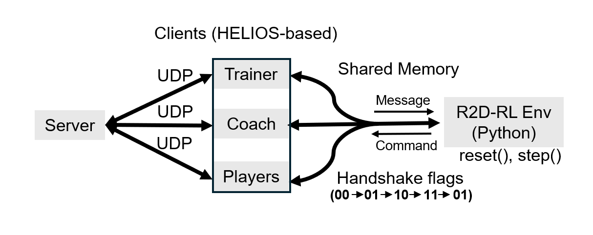

# R2DRL - RoboCup2D Reinforcement Learning

R2DRL is a RoboCup 2D Soccer Simulation reinforcement learning stack built around shared-memory communication, Helios-based agents, and PyMARL-style training workflows.



## What Is In This Repository

The repository is organized around the `R2DRL/robocup2d` environment package.

- `R2DRL/robocup2d/env.py`
  Main environment entry points: `Robocup2dEnv`, `R2DRL`, and `ParallelR2DRL`.
- `R2DRL/robocup2d/config/`
  All maintained YAML configs live here now.
- `R2DRL/robocup2d/start_sampler.py`
  Scenario/custom-start sampling for 3v3 tasks.
- `R2DRL/robocup2d/BENCHMARKS.md`
  Benchmark/task presets.
- `R2DRL/robocup2d/GUIDE_CN.md`
  Full Chinese guide for setup, config, workflow, and debugging.
- `R2DRL/robocup2d/ENV_USAGE_CN.md`
  Usage notes and common command patterns.

## Supported Tasks

The current config layout supports:

- `11vs11` benchmark and full-match tasks
- `3vs3` scenario/custom-start tasks
- `Base` discrete action space
- `Hybrid` parameterized action space

Main environment config entry points:

- `R2DRL/robocup2d/config/robocup.yaml`
- `R2DRL/robocup2d/config/r2drl.yaml`
- `R2DRL/robocup2d/config/parallelr2drl.yaml`

Example benchmark presets:

- `parallelr2drl_11vs11benchmark_base_opp-lv1_epv-off.yaml`
- `parallelr2drl_11vs11benchmark_base_opp-lv2_epv-on.yaml`
- `parallelr2drl_11vs11fullmatch_team-base_opp-lv3_epv-on.yaml`
- `parallelr2drl_3vs3scenario_base_init-3_start-hard_opp-lv1_epv-on.yaml`
- `parallelr2drl_3vs3scenario_base_init-3_start-hard_opp-lv3_epv-on.yaml`
- `parallelr2drl_3vs3scenario_hybrid_init-3_start-hard_opp-lv3_epv-on.yaml`

## Setup

### 1. Clone This Repository

```bash
git clone https://github.com/open-starlab/R2DRL.git
cd R2DRL
```

### 2. Prepare External Dependencies

You will also need:

- `rcssserver`
- `rcssmonitor`
- `librcsc`
- `helios-base`

Recommended upstream repositories:

- `https://github.com/rcsoccersim/rcssserver`
- `https://github.com/rcsoccersim/rcssmonitor`
- `https://github.com/helios-base/librcsc`
- `https://github.com/helios-base/helios-base`

This project assumes you copy the modified files from this repository into your local `librcsc` and `helios-base` checkouts before building them.

### 3. Increase Simulator Wait Timeout

Long RL rollouts usually need a much larger server-side wait budget. One practical patch is:

```bash
sed -i.bak '2396s/.*/    const double max_msec_waited = 60 * 60 * 1000;/' rcssserver/src/stadium.cpp
```

Then rebuild `rcssserver`.

### 4. Build Dependencies

Build `rcssserver`, `rcssmonitor`, `librcsc`, and `helios-base` with their normal build instructions.

### 5. Install The Python Package

```bash
cd R2DRL/R2DRL/robocup2d
pip install -e .
```

## Configuration

Before running, update the environment YAML paths to match your local machine. The most important fields are:

```yaml
player_dir: "<PROJECT_ROOT>/helios-base/src/player"
player_exe: "./sample_player"
coach_dir: "<PROJECT_ROOT>/helios-base/src/coach"
coach_exe: "./sample_coach"
trainer_dir: "<PROJECT_ROOT>/helios-base/src/trainer"
trainer_exe: "./sample_trainer"
server_path: "<PROJECT_ROOT>/rcssserver/build/rcssserver"
config_dir: "<PROJECT_ROOT>/helios-base/src/formations-dt"
player_config: "<PROJECT_ROOT>/helios-base/src/player.conf"

lib_paths:
  - "<PROJECT_ROOT>/librcsc/rcsc/.libs"
```

Important runtime knobs include:

- `n`
  Team size, such as `11` or `3`
- `team`
  Action space type: `Base` or `Hybrid`
- `opponent_level`
  Opponent difficulty passed through to the underlying player executable
- `episode_limit`
  RL episode timeout in environment steps
- `half_time`
  Simulator half-time setting
- `use_custom_start`
  Whether to use sampled scenario starts
- `trajectory_path`
  3v3 scenario trajectory dataset
- `terminate_on_goal`
  Whether to end an episode immediately after a goal
- `game_logging`
  Whether to keep simulator game logs

## Running Training

Typical PyMARL invocation:

```bash
python -u main.py --config=qmix --env-config=parallelr2drl_3vs3scenario_base_init-3_start-hard_opp-lv3_epv-on --capture=no
```

Single-environment usage example:

```python
import numpy as np
from robocup2d import Robocup2dEnv

env = Robocup2dEnv("path/to/robocup.yaml")
env.reset()

done = False
while not done:
    obs = env.get_obs()
    state = env.get_state()
    avail_actions = env.get_avail_actions()
    actions = np.random.randint(0, 17, size=env.config.n1)
    reward, done, info = env.step(actions)

env.close()
```

## Troubleshooting

Check for lingering simulator processes:

```bash
ps -ef | grep -E "rcssserver|sample_player|sample_coach|sample_trainer"
```

Force-clean them if necessary:

```bash
killall -9 rcssserver sample_player sample_coach sample_trainer
```

If you are working in the upstream development repository rather than this GitHub mirror, the most detailed operational notes are in:

- `R2DRL/robocup2d/GUIDE_CN.md`
- `R2DRL/robocup2d/ENV_USAGE_CN.md`
- `R2DRL/robocup2d/BENCHMARKS.md`

## Acknowledgments

This project builds on:

- https://github.com/rcsoccersim/rcssserver
- https://github.com/rcsoccersim/rcssmonitor
- https://github.com/helios-base/librcsc
- https://github.com/helios-base/helios-base
